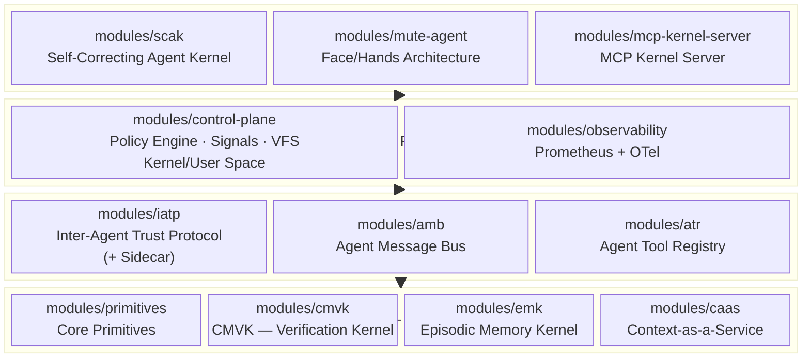
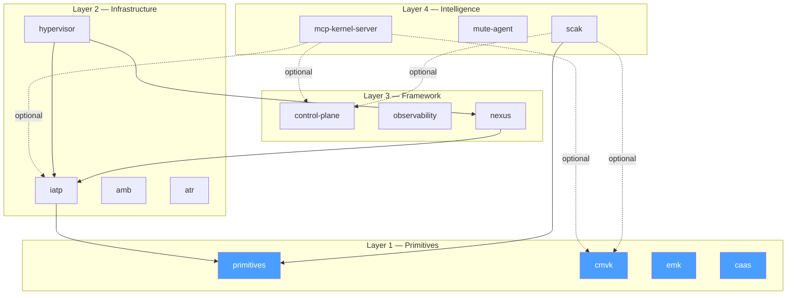
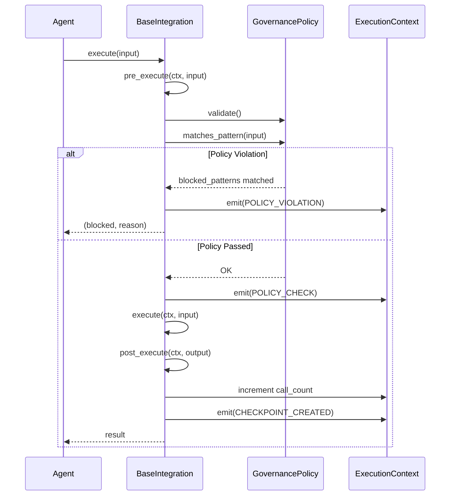
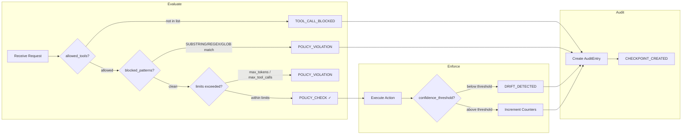
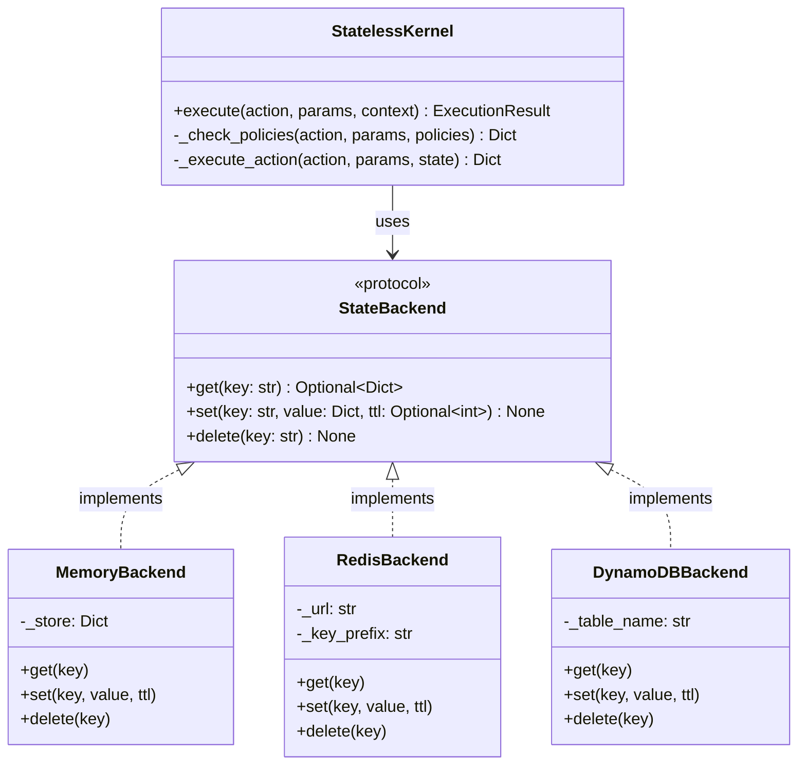
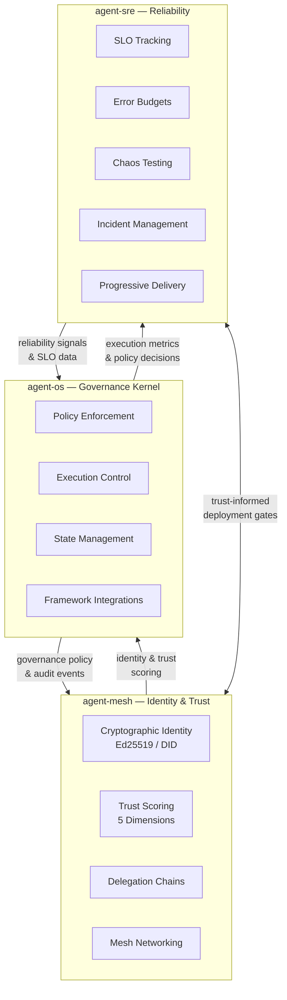

# Agent-OS Architecture

> **agent-os** is a governance-first kernel for AI agents — a Python framework providing policy enforcement, semantic intent classification, identity management, and execution control for autonomous AI agents.

## 4-Layer Kernel Architecture

Agent-OS follows a strict layered architecture where lower layers never depend on higher layers.

## Module Dependency Graph

Dependencies derived from each module's `pyproject.toml` and import analysis:

> **Solid arrows** = declared dependencies. **Dashed arrows** = optional/soft dependencies.

## Integration Adapter Lifecycle

Framework integrations (LangChain, CrewAI, etc.) follow a governed execution lifecycle via `BaseIntegration`:

## Policy Decision Flow

`GovernancePolicy` enforces constraints at every execution boundary:

**GovernancePolicy fields:**

| Field | Type | Purpose |
|-------|------|---------|
| `max_tokens_per_request` | `int` | Token budget per execution |
| `max_tool_calls_per_request` | `int` | Tool call limit per execution |
| `blocked_patterns` | `list[BlockedPattern]` | SUBSTRING, REGEX, or GLOB patterns to reject |
| `allowed_tools` | `list[str]` | Allowlist of permitted tool names |
| `confidence_threshold` | `float` | Minimum confidence before drift is flagged |

## State Backend Abstraction

Agent-OS uses a pluggable `StateBackend` protocol for execution state persistence:

**Usage:** `MemoryBackend` for development/testing, `RedisBackend` for production, `DynamoDBBackend` for serverless deployments.

## Cross-Repo Ecosystem

Agent-OS is one component of a three-repo ecosystem:

| Repository | Provides | Consumes |
|-----------|----------|----------|
| **agent-os** | Governance kernel, policy enforcement, execution control | Identity from agent-mesh, reliability signals from agent-sre |
| **agent-mesh** | Cryptographic identity (Ed25519/DID), trust scoring (5 dimensions), delegation chains | Governance policies and audit events from agent-os |
| **agent-sre** | SLO tracking, error budgets, chaos testing, incident management, progressive delivery | Execution metrics from agent-os, trust data from agent-mesh |
