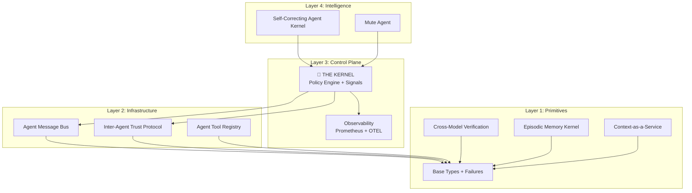

<div align="center">

# Agent OS

**A kernel architecture for governing autonomous AI agents**

[](https://github.com/imran-siddique/agent-os/stargazers)
[](https://github.com/sponsors/imran-siddique)
[](LICENSE)
[](https://python.org)
[](https://github.com/imran-siddique/agent-os/actions/workflows/ci.yml)
[](https://pypi.org/project/agent-os-kernel/)
[](https://pypi.org/project/agent-os-kernel/)
[](https://marketplace.visualstudio.com/items?itemName=agent-os.agent-os-vscode)
[](https://imran-siddique.github.io/agent-os-docs/)
[](https://github.com/Shubhamsaboo/awesome-llm-apps)
[](https://github.com/punkpeye/awesome-mcp-servers)
[](https://github.com/microsoft/agent-lightning/tree/main/contrib/recipes/agentos)
[](https://github.com/run-llama/llama_index/pull/20644)
[](https://pepy.tech/project/agent-os-kernel)

> ⭐ **If this project helps you, please star it!** It helps others discover Agent OS.

[Quick Start](#quick-example) • [Documentation](https://imran-siddique.github.io/agent-os-docs/) • [VS Code Extension](https://marketplace.visualstudio.com/items?itemName=agent-os.agent-os-vscode) • [Examples](examples/) • [AgentMesh (Multi-Agent Trust)](https://github.com/imran-siddique/agent-mesh)

<br/>

[](https://gitpod.io/#https://github.com/imran-siddique/agent-os)

*Try Agent OS instantly in your browser - no installation required*

</div>

### Integrated With

<p align="center">
  <a href="https://github.com/langgenius/dify-plugins/pull/2060"></a>
  <a href="https://github.com/run-llama/llama_index/pull/20644"></a>
  <a href="https://github.com/microsoft/agent-lightning/pull/478"></a>
  <a href="https://pypi.org/project/langgraph-trust/"></a>
  <a href="https://pypi.org/project/openai-agents-trust/"></a>
  <a href="https://clawhub.ai/imran-siddique/agentmesh-governance"></a>
</p>

> **6 framework integrations** across 170K+ GitHub stars. Governance for [Dify](https://github.com/langgenius/dify-plugins/pull/2060) (65K ⭐), [LlamaIndex](https://github.com/run-llama/llama_index/pull/20644) (47K ⭐), [LangGraph](https://pypi.org/project/langgraph-trust/), [OpenAI Agents](https://pypi.org/project/openai-agents-trust/), [Agent-Lightning](https://github.com/microsoft/agent-lightning/pull/478), and [OpenClaw](https://clawhub.ai/imran-siddique/agentmesh-governance).

---

## ⚡ Quick Start in 30 Seconds

```bash
pip install agent-os-kernel
```

```python
from agent_os import StatelessKernel

# Create a governed agent in 3 lines
kernel = StatelessKernel()

# Your agent runs with policy enforcement
result = await kernel.execute(
    action="database_query",
    params={"query": "SELECT * FROM users"},
    policies=["read_only"]
)
# ✅ Safe queries execute
# ❌ "DROP TABLE users" → Blocked by kernel
```

That's it! Your agent now has deterministic policy enforcement. [Learn more →](#what-is-agent-os)

**🎬 See all features in action:**
```bash
git clone https://github.com/imran-siddique/agent-os && python agent-os/demo.py
```

<details>
<summary><b>📋 More examples (click to expand)</b></summary>

### Policy enforcement with custom rules

```python
from agent_os import StatelessKernel

kernel = StatelessKernel()
kernel.load_policy_yaml("""
version: "1.0"
name: api-safety
rules:
  - name: block-destructive-sql
    condition: "action == 'database_query'"
    action: deny
    pattern: "DROP|TRUNCATE|DELETE FROM .* WHERE 1=1"
  - name: rate-limit-api
    condition: "action == 'api_call'"
    limit: "100/hour"
""")

result = await kernel.execute(action="database_query", params={"query": "DROP TABLE users"})
# ❌ Blocked: Matched rule 'block-destructive-sql'
```

### Audit logging

```python
from agent_os import KernelSpace

kernel = KernelSpace()

# Every kernel action is automatically recorded
result = await kernel.execute(action="read_file", params={"path": "/data/report.csv"})

# Query the flight recorder
entries = kernel.flight_recorder.query(agent_id="agent-001", limit=10)
for entry in entries:
    print(f"{entry.timestamp} | {entry.action} | {entry.outcome}")
```

### Governed chatbot with memory

```python
from agent_os import KernelSpace
from agent_os.emk import EpisodicMemory

kernel = KernelSpace(policy_file="policies.yaml")
memory = EpisodicMemory(max_turns=50)

@kernel.register
async def chat(message: str, conversation_id: str = "default") -> str:
    history = memory.get_history(conversation_id)
    response = await call_llm(history + [{"role": "user", "content": message}])
    memory.add_turn(conversation_id, message, response)
    return response
# Outputs are checked against content policies; violations trigger SIGSTOP
```

See [examples/](examples/) for 20+ runnable demos including SQL agents, GitHub reviewers, and compliance bots.
</details>

---

<p align="center">
  
</p>

---

## 🎯 What You'll Build in 5 Minutes

```python
from agent_os import StatelessKernel, stateless_execute

# 1. Define safety policies (not prompts — actual enforcement)
kernel = StatelessKernel(policies=["read_only", "no_pii"])

# 2. Actions are checked against policies before execution
result = await stateless_execute(
    action="database_query",
    params={"query": "SELECT revenue FROM sales"},
    agent_id="analyst-001",
    policies=["read_only"]
)
# ✅ Safe queries execute
# ❌ "DROP TABLE users" → BLOCKED (not by prompt, by kernel)
```

**Result:** Defined policies are deterministically enforced by the kernel—not by hoping the LLM follows instructions.

For the full kernel with signals, VFS, and protection rings:

```python
from agent_os import KernelSpace, AgentSignal, AgentVFS

# Requires: pip install agent-os-kernel[full]
kernel = KernelSpace()
ctx = kernel.create_agent_context("agent-001")
await ctx.write("/mem/working/task.txt", "Hello World")
```

> **Note:** `KernelSpace`, `AgentSignal`, and `AgentVFS` require installing the control-plane module: `pip install agent-os-kernel[full]`

---

## What is Agent OS?

Agent OS applies operating system concepts to AI agent governance. Instead of relying on prompts to enforce safety ("please don't do dangerous things"), it provides application-level middleware that intercepts and validates agent actions before execution.

> **Note:** This is application-level enforcement (Python middleware), not OS kernel-level isolation. Agents run in the same process. For true isolation, run agents in containers.

```
┌─────────────────────────────────────────────────────────┐
│              USER SPACE (Agent Code)                    │
│   Your agent code runs here. The kernel intercepts      │
│   actions before they execute.                          │
├─────────────────────────────────────────────────────────┤
│              KERNEL SPACE                               │
│   Policy Engine │ Flight Recorder │ Signal Dispatch     │
│   Actions are checked against policies before execution │
└─────────────────────────────────────────────────────────┘
```

## The Idea

**Prompt-based safety** asks the LLM to follow rules. The LLM decides whether to comply.

**Kernel-based safety** intercepts actions before execution. The policy engine decides, not the LLM.

This is the same principle operating systems use: applications request resources, the kernel grants or denies access based on permissions.

---

## Architecture



### Directory Structure

```
agent-os/
├── src/agent_os/             # Core Python package
│   ├── __init__.py           # Public API (re-exports from all layers)
│   ├── stateless.py          # StatelessKernel (zero-dependency core)
│   ├── base_agent.py         # BaseAgent, ToolUsingAgent classes
│   ├── agents_compat.py      # AGENTS.md parser (OpenAI/Anthropic standard)
│   ├── cli.py                # CLI (agent-os check, review, init, etc.)
│   └── integrations/         # Framework adapters (LangChain, OpenAI, etc.)
├── modules/                  # Kernel Modules (4-layer architecture)
│   ├── primitives/           # Layer 1: Base types and failures
│   ├── cmvk/                 # Layer 1: Cross-model verification
│   ├── emk/                  # Layer 1: Episodic memory kernel
│   ├── caas/                 # Layer 1: Context-as-a-Service
│   ├── amb/                  # Layer 2: Agent message bus
│   ├── iatp/                 # Layer 2: Inter-agent trust protocol
│   ├── atr/                  # Layer 2: Agent tool registry
│   ├── observability/        # Layer 3: Prometheus + OpenTelemetry
│   ├── control-plane/        # Layer 3: THE KERNEL (policies, signals)
│   ├── scak/                 # Layer 4: Self-correcting agent kernel
│   ├── mute-agent/           # Layer 4: Face/Hands architecture
│   ├── nexus/                # Experimental: Trust exchange network
│   └── mcp-kernel-server/    # Integration: MCP protocol support
├── extensions/               # IDE & AI Assistant Extensions
│   ├── mcp-server/           # ⭐ MCP Server (Copilot, Claude, Cursor)
│   ├── vscode/               # VS Code extension
│   ├── copilot/              # GitHub Copilot extension
│   ├── jetbrains/            # IntelliJ/PyCharm plugin
│   ├── cursor/               # Cursor IDE extension
│   ├── chrome/               # Chrome extension
│   └── github-cli/           # gh CLI extension
├── examples/                 # Working examples
├── docs/                     # Documentation
├── tests/                    # Test suite (organized by layer)
├── notebooks/                # Jupyter tutorials
├── papers/                   # Research papers
└── templates/                # Policy templates
```

---

## Core Modules

| Module | Layer | PyPI Package | Description | Status |
|--------|-------|-------------|-------------|--------|
| [`primitives`](modules/primitives/) | 1 | `agent-primitives` | Base failure types, severity levels | ✅ Stable |
| [`cmvk`](modules/cmvk/) | 1 | `cmvk` | Cross-model verification, drift detection | ✅ Stable |
| [`emk`](modules/emk/) | 1 | `emk` | Episodic memory kernel (append-only ledger) | ✅ Stable |
| [`caas`](modules/caas/) | 1 | `caas-core` | Context-as-a-Service, RAG pipeline | ✅ Stable |
| [`amb`](modules/amb/) | 2 | `amb-core` | Agent message bus (async pub/sub) | ✅ Stable |
| [`iatp`](modules/iatp/) | 2 | `inter-agent-trust-protocol` | Sidecar trust protocol, typed IPC pipes | ✅ Stable |
| [`atr`](modules/atr/) | 2 | `agent-tool-registry` | Tool registry with LLM schema generation | ✅ Stable |
| [`control-plane`](modules/control-plane/) | 3 | `agent-control-plane` | **THE KERNEL** — Policy engine, signals, VFS | ✅ Stable |
| [`observability`](modules/observability/) | 3 | `agent-os-observability` | Prometheus metrics + OpenTelemetry tracing | ⚠️ No tests |
| [`scak`](modules/scak/) | 4 | `scak` | Self-correcting agent kernel | ✅ Stable |
| [`mute-agent`](modules/mute-agent/) | 4 | `mute-agent` | Decoupled reasoning/execution architecture | ⚠️ No tests |
| [`nexus`](modules/nexus/) | — | *Not published* | Trust exchange network | 🔬 Prototype |
| [`mcp-kernel-server`](modules/mcp-kernel-server/) | Int | `mcp-kernel-server` | MCP server for Claude Desktop | ⚠️ No tests |

---

## IDE & CLI Extensions

| Extension | Description | Status |
|-----------|-------------|--------|
| [`mcp-server`](extensions/mcp-server/) | ⭐ **MCP Server** — Works with Claude, Copilot, Cursor (`npx agentos-mcp-server`) | ✅ Published (v1.0.1) |
| [`vscode`](extensions/vscode/) | VS Code extension with real-time policy checks, enterprise features | ✅ Published (v1.0.1) |
| [`copilot`](extensions/copilot/) | GitHub Copilot extension (Vercel/Docker deployment) | ✅ Published (v1.0.0) |
| [`jetbrains`](extensions/jetbrains/) | IntelliJ, PyCharm, WebStorm plugin (Kotlin) | ✅ Built (v1.0.0) |
| [`cursor`](extensions/cursor/) | Cursor IDE extension (Composer integration) | ✅ Built (v0.1.0) |
| [`chrome`](extensions/chrome/) | Chrome extension for GitHub, Jira, AWS, GitLab | ✅ Built (v1.0.0) |
| [`github-cli`](extensions/github-cli/) | `gh agent-os` CLI extension | ⚠️ Basic |

---

## Install

```bash
pip install agent-os-kernel
```

Or with optional components:

```bash
pip install agent-os-kernel[cmvk]           # + cross-model verification
pip install agent-os-kernel[iatp]           # + inter-agent trust
pip install agent-os-kernel[observability]  # + Prometheus/OpenTelemetry
pip install agent-os-kernel[nexus]          # + trust exchange network
pip install agent-os-kernel[full]           # Everything
```

### One-Command Quickstart

**macOS/Linux:**
```bash
curl -sSL https://raw.githubusercontent.com/imran-siddique/agent-os/main/scripts/quickstart.sh | bash
```

**Windows (PowerShell):**
```powershell
iwr -useb https://raw.githubusercontent.com/imran-siddique/agent-os/main/scripts/quickstart.ps1 | iex
```

---

## Quick Example

### Stateless API (Always Available — Zero Dependencies Beyond Pydantic)

```python
from agent_os import StatelessKernel, stateless_execute

# Create kernel with policy
kernel = StatelessKernel(policies=["read_only", "no_pii"])

# Execute with policy enforcement
result = await stateless_execute(
    action="database_query",
    params={"query": "SELECT * FROM users"},
    agent_id="analyst-001",
    policies=["read_only"]
)
```

### Full Kernel API (Requires `pip install agent-os-kernel[full]`)

```python
from agent_os import KernelSpace, AgentSignal, PolicyRule

kernel = KernelSpace()

# Create agent context with VFS
ctx = kernel.create_agent_context("agent-001")
await ctx.write("/mem/working/task.txt", "analyze this data")

# Policy enforcement
from agent_os import PolicyEngine
engine = PolicyEngine()
engine.add_rule(PolicyRule(name="no_sql_injection", pattern="DROP|DELETE|TRUNCATE"))
```

---

## POSIX-Inspired Primitives

Agent OS borrows concepts from POSIX operating systems:

| Concept | POSIX | Agent OS |
|---------|-------|----------|
| Process control | `SIGKILL`, `SIGSTOP` | `AgentSignal.SIGKILL`, `AgentSignal.SIGSTOP` |
| Filesystem | `/proc`, `/tmp` | VFS with `/mem/working`, `/mem/episodic` |
| IPC | Pipes (`\|`) | Typed IPC pipes between agents |
| Syscalls | `open()`, `read()` | `kernel.execute()` |

### Signals

```python
# Requires: pip install agent-os-kernel[full]
from agent_os import SignalDispatcher, AgentSignal

dispatcher = SignalDispatcher()
dispatcher.signal(agent_id, AgentSignal.SIGSTOP)  # Pause
dispatcher.signal(agent_id, AgentSignal.SIGCONT)  # Resume
dispatcher.signal(agent_id, AgentSignal.SIGKILL)  # Terminate
```

### VFS (Virtual File System)

```python
# Requires: pip install agent-os-kernel[full]
from agent_os import AgentVFS

vfs = AgentVFS(agent_id="agent-001")
vfs.write("/mem/working/task.txt", "Current task")
vfs.read("/policy/rules.yaml")  # Read-only from user space
```

---

## Framework Integrations

Wrap existing frameworks with Agent OS governance:

```python
# LangChain
from agent_os.integrations import LangChainKernel
governed = LangChainKernel().wrap(my_chain)

# OpenAI Assistants
from agent_os.integrations import OpenAIKernel
governed = OpenAIKernel().wrap_assistant(assistant, client)

# Semantic Kernel
from agent_os.integrations import SemanticKernelWrapper
governed = SemanticKernelWrapper().wrap(sk_kernel)

# CrewAI
from agent_os.integrations import CrewAIKernel
governed = CrewAIKernel().wrap(my_crew)

# AutoGen
from agent_os.integrations import AutoGenKernel
governed = AutoGenKernel().wrap(autogen_agent)

# OpenAI Agents SDK
from agent_os.integrations import OpenAIAgentsSDKKernel
governed = OpenAIAgentsSDKKernel().wrap(agent)
```

> **Note:** These adapters use lazy interception — they don't require the target framework to be installed until you call `.wrap()`.

See [integrations documentation](docs/integrations.md) for full details.

---

## How It Differs from Other Tools

**Agent Frameworks** (LangChain, CrewAI): Build agents. Agent OS governs them. Use together.

**Safety Tools** (NeMo Guardrails, LlamaGuard): Input/output filtering. Agent OS intercepts actions mid-execution.

| Tool | Focus | When it acts |
|------|-------|--------------|
| LangChain/CrewAI | Building agents | N/A (framework) |
| NeMo Guardrails | Input/output filtering | Before/after LLM call |
| LlamaGuard | Content classification | Before/after LLM call |
| **Agent OS** | Action interception | During execution |

---

## Examples

The `examples/` directory contains demos at various levels:

### Getting Started

| Demo | Description | Command |
|------|-------------|---------|
| [demo-app](examples/demo-app/) | Uses the stateless API (most reliable) | `cd examples/demo-app && python demo.py` |
| [hello-world](examples/hello-world/) | Minimal example | `cd examples/hello-world && python agent.py` |
| [quickstart](examples/quickstart/) | Quick intro | `cd examples/quickstart && python my_first_agent.py` |

### Domain Examples (Self-Contained)

These examples are self-contained and don't require external Agent OS imports:

| Demo | Description |
|------|-------------|
| [healthcare-hipaa](examples/healthcare-hipaa/) | HIPAA-compliant agent |
| [customer-service](examples/customer-service/) | Customer support agent |
| [legal-review](examples/legal-review/) | Legal document analysis |
| [crewai-safe-mode](examples/crewai-safe-mode/) | CrewAI with safety wrappers |

### Production Demos (with Docker + Observability)

| Demo | Description | Command |
|------|-------------|---------|
| [carbon-auditor](examples/carbon-auditor/) | Multi-model verification | `cd examples/carbon-auditor && docker-compose up` |
| [grid-balancing](examples/grid-balancing/) | Multi-agent coordination | `cd examples/grid-balancing && docker-compose up` |
| [defi-sentinel](examples/defi-sentinel/) | Real-time attack detection | `cd examples/defi-sentinel && docker-compose up` |
| [pharma-compliance](examples/pharma-compliance/) | Document analysis | `cd examples/pharma-compliance && docker-compose up` |

Each production demo includes:
- **Grafana dashboard** on port 300X
- **Prometheus metrics** on port 909X
- **Jaeger tracing** on port 1668X

```bash
# Run carbon auditor with full observability
cd examples/carbon-auditor
cp .env.example .env  # Optional: add API keys
docker-compose up

# Open dashboards
open http://localhost:3000  # Grafana (admin/admin)
open http://localhost:16686 # Jaeger traces
```

---

## Safe Tool Plugins

Agent OS includes pre-built safe tools via the Agent Tool Registry:

```python
# Requires: pip install agent-os-kernel[full]
from atr import ToolRegistry, tool

@tool(name="safe_http", description="Rate-limited HTTP requests")
async def safe_http(url: str) -> dict:
    # Tool is automatically registered and sandboxed
    ...

registry = ToolRegistry()
registry.register(safe_http)

# Generate schemas for any LLM
openai_tools = registry.to_openai_schema()
anthropic_tools = registry.to_anthropic_schema()
```

---

## Message Bus

Connect agents using the async message bus:

```python
# Requires: pip install agent-os-kernel[full]
from amb_core import MessageBus, Message

bus = MessageBus()
await bus.subscribe("tasks", handler)
await bus.publish("tasks", Message(payload={"task": "analyze"}))
```

Broker adapters available for Redis, Kafka, and NATS (requires optional dependencies).

---

## CLI Tool

Agent OS includes a CLI for terminal workflows:

```bash
# Check files for safety violations
agent-os check src/app.py

# Check staged git files (pre-commit)
agent-os check --staged

# Multi-model code review (simulated in current version)
agent-os review src/app.py

# Install git pre-commit hook
agent-os install-hooks

# Initialize Agent OS in project
agent-os init

# Validate AGENTS.md configuration
agent-os validate
```

---

## MCP Integration (Claude Desktop, GitHub Copilot, Cursor)

Agent OS provides an MCP server that works with any MCP-compatible AI assistant:

```bash
# Quick install via npx
npx agentos-mcp-server
```

**npm:** [`agentos-mcp-server`](https://www.npmjs.com/package/agentos-mcp-server)  
**MCP Registry:** `io.github.imran-siddique/agentos`

Add to your config file:

**Claude Desktop** (`%APPDATA%\Claude\claude_desktop_config.json` on Windows):
```json
{
  "mcpServers": {
    "agentos": {
      "command": "npx",
      "args": ["-y", "agentos-mcp-server"]
    }
  }
}
```

**Features:** 10 tools for agent creation, policy enforcement, compliance checking (SOC 2, GDPR, HIPAA), human-in-the-loop approvals, and audit logging.

See [MCP server documentation](extensions/mcp-server/README.md) for full details.

---

## Documentation

### Tutorials
- [5-Minute Quickstart](docs/tutorials/5-minute-quickstart.md) — Get running fast
- [30-Minute Deep Dive](docs/tutorials/30-minute-deep-dive.md) — Comprehensive walkthrough
- [Building Your First Governed Agent](docs/tutorials/first-governed-agent.md) — Complete tutorial
- [Using Message Bus Adapters](docs/tutorials/message-bus-adapters.md) — Connect agents
- [Creating Custom Tools](docs/tutorials/custom-tools.md) — Build safe tools
- [Cheatsheet](docs/cheatsheet.md) — Quick reference

### Interactive Notebooks

| Notebook | Description | Time |
|----------|-------------|------|
| [Hello Agent OS](notebooks/01-hello-agent-os.ipynb) | Your first governed agent | 5 min |
| [Episodic Memory](notebooks/02-episodic-memory-demo.ipynb) | Agent memory that persists | 15 min |
| [Time-Travel Debugging](notebooks/03-time-travel-debugging.ipynb) | Replay and debug decisions | 20 min |
| [Cross-Model Verification](notebooks/04-cross-model-verification.ipynb) | Detect hallucinations | 15 min |
| [Multi-Agent Coordination](notebooks/05-multi-agent-coordination.ipynb) | Trust between agents | 20 min |
| [Policy Engine](notebooks/06-policy-engine.ipynb) | Deep dive into policies | 15 min |

### Reference
- [Quickstart Guide](docs/quickstart.md) — 60 seconds to first agent
- [Framework Integrations](docs/integrations.md) — LangChain, OpenAI, etc.
- [Kernel Internals](docs/kernel-internals.md) — How the kernel works
- [Architecture Overview](docs/architecture.md) — System design
- [CMVK Algorithm](docs/cmvk-algorithm.md) — Cross-model verification
- [RFC-003: Agent Signals](docs/rfcs/RFC-003-Agent-Signals.md) — POSIX-style signals
- [RFC-004: Agent Primitives](docs/rfcs/RFC-004-Agent-Primitives.md) — Core primitives

---

## Status & Maturity

This is a research project exploring kernel concepts for AI agent governance.

### ✅ Production-Ready

These components are fully implemented and tested:

| Component | Tests |
|-----------|-------|
| **StatelessKernel** — Zero-dependency policy enforcement (`src/agent_os/`) | ✅ Full coverage |
| **Policy Engine** — Deterministic rule enforcement | ✅ Tested |
| **Flight Recorder** — SQLite-based audit logging | ✅ Tested |
| **CLI** — `agent-os check`, `init`, `secure`, `validate` | ✅ Tested |
| **Framework Adapters** — LangChain, OpenAI, Semantic Kernel, CrewAI, AutoGen, OpenAI Agents SDK | ✅ Implemented |
| **AGENTS.md Parser** — OpenAI/Anthropic standard agent config | ✅ Full coverage |
| **Primitives** (`agent-primitives`) — Failure types, severity levels | ✅ Tested |
| **CMVK** (`cmvk`) — Drift detection, distance metrics (955+ lines) | ✅ Tested |
| **EMK** (`emk`) — Episodic memory with JSONL storage | ✅ 8 test files |
| **AMB** (`amb-core`) — Async message bus, DLQ, tracing | ✅ 6 test files |
| **IATP** (`inter-agent-trust-protocol`) — Sidecar trust, typed IPC | ✅ 9 test files |
| **ATR** (`agent-tool-registry`) — Multi-LLM schema generation | ✅ 6 test files |
| **Control Plane** (`agent-control-plane`) — Signals, VFS, protection rings | ✅ 18 test files |
| **SCAK** (`scak`) — Self-correcting agent kernel | ✅ 23 test files |

### ⚠️ Experimental (Code Exists, Tests Missing or Incomplete)

| Component | What's Missing |
|-----------|----------------|
| **Mute Agent** (`mute-agent`) | No tests; all layer dependencies use mock adapters |
| **Observability** (`agent-os-observability`) | No tests; Prometheus metrics, Grafana dashboards, OTel tracing implemented |
| **MCP Kernel Server** (`mcp-kernel-server`) | No tests; 1173-line implementation |
| **GitHub CLI Extension** | Single bash script with simulated output |
| **Control Plane MCP Adapter** | Placeholder — returns canned responses |
| **Control Plane A2A Adapter** | Placeholder — negotiation accepts all params |

### 🔬 Research Prototype

| Component | What's Missing |
|-----------|----------------|
| **Nexus Trust Exchange** | No `pyproject.toml`, no tests, placeholder cryptography (XOR — **not secure**), all signature verification stubbed, in-memory storage only |

### Known Architectural Limitations

| Limitation | Impact | Mitigation |
|------------|--------|------------|
| **Application-level only** | Direct stdlib calls (`subprocess`, `open`) bypass kernel | Pair with container isolation for production |
| **Blocklist-based policies** | Novel attack patterns not in rules will pass | Add AST-level parsing (#32), use defense in depth |
| **Shadow Mode single-step** | Multi-step agent simulations diverge from reality | Use for single-turn validation only |
| **No tamper-proof audit** | Flight Recorder SQLite can be modified by compromised agent | Write to external sink for critical audits |
| **Provider-coupled adapters** | Each SDK needs separate adapter | Abstract interface planned (#47) |

See [GitHub Issues](https://github.com/imran-siddique/agent-os/issues) for the full roadmap.

---

## FAQ

### How is this different from prompt-based safety?

Prompt-based safety relies on instructing the LLM to follow rules via system prompts. This approach is probabilistic — the model may still produce unsafe outputs under certain conditions.

Agent OS enforces policies at the middleware layer. Actions are intercepted and validated before execution, making enforcement deterministic rather than dependent on model compliance.

### What frameworks are supported?

Agent OS can wrap and govern agents built with popular frameworks including LangChain, CrewAI, AutoGen, Semantic Kernel, and the OpenAI SDK. It also supports MCP-based integrations.

### Can I use this in production?

Core components such as the **StatelessKernel** and **Policy Engine** are production-ready. However, Agent OS provides application-level enforcement. For high-security environments, it should be combined with infrastructure isolation (e.g., containers).

### How do I write custom policies?

Custom policies can be defined programmatically in Python or declaratively using YAML. Policies define rules that inspect and allow or deny agent actions before execution.

### What is the performance overhead?

Policy checks are lightweight and typically introduce only minimal latency per action. The overhead depends on the number and complexity of rules configured.

---

## Troubleshooting

### Common Issues

**ModuleNotFoundError: No module named 'agent_os'**
```bash
# Install from source
git clone https://github.com/imran-siddique/agent-os.git
cd agent-os
pip install -e .
```

**Optional modules not available**
```bash
# Check what's installed
python -c "from agent_os import check_installation; check_installation()"

# Install everything
pip install -e ".[full]"
```

**Permission errors on Windows**
```bash
# Run PowerShell as Administrator, or use --user flag
pip install --user -e .
```

**Docker not working**
```bash
# Build with Dockerfile (no Docker Compose needed for simple tests)
docker build -t agent-os .
docker run -it agent-os python examples/demo-app/demo.py
```

**Tests failing with API errors**
```bash
# Most tests work without API keys — mock mode is default
pytest tests/ -v

# For real LLM tests, set environment variables
export OPENAI_API_KEY=sk-...
export ANTHROPIC_API_KEY=sk-ant-...
```

---

## Contributing

```bash
git clone https://github.com/imran-siddique/agent-os.git
cd agent-os
pip install -e ".[dev]"
pytest
```

---

## License

MIT — See [LICENSE](LICENSE)

---

<div align="center">

**Exploring kernel concepts for AI agent safety.**

[GitHub](https://github.com/imran-siddique/agent-os) · [Docs](docs/)

</div>
