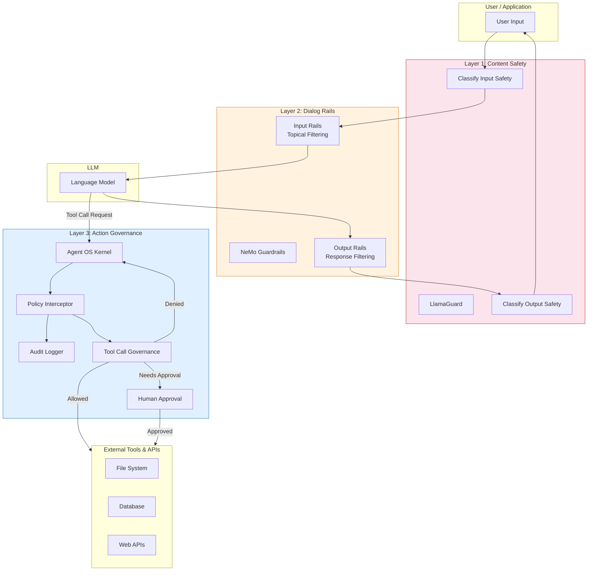

# Comparison Guide: Agent OS vs NeMo Guardrails vs LlamaGuard

> **Audience:** Developers and architects choosing AI safety tooling for agentic systems.
>
> This guide compares three complementary approaches to governing AI agent behavior.

---

## Table of Contents

- [Executive Summary](#executive-summary)
- [When to Use Which](#when-to-use-which)
- [Feature Comparison](#feature-comparison)
- [Architecture Overview](#architecture-overview)
- [Code Examples](#code-examples)
- [Using Them Together](#using-them-together)

---

## Executive Summary

| Tool | Core Approach | Best For |
|------|--------------|----------|
| **Agent OS** | Kernel-level action interception **during** execution | Governing tool calls, enforcing policies in real-time, multi-agent orchestration |
| **NeMo Guardrails** | Input/output rails **before/after** LLM calls | Dialog management, topical guardrails, conversational safety |
| **LlamaGuard** | Content classification **before/after** LLM calls | Content safety screening, toxicity filtering, category-based moderation |

These tools operate at **different enforcement points** and are complementary rather than competing. Agent OS governs what agents *do* (actions and tool calls). NeMo Guardrails governs what agents *say* (dialog flow and topic boundaries). LlamaGuard classifies whether content is *safe* (content moderation).

---

## When to Use Which

### Choose Agent OS when you need to:

- **Intercept and govern tool calls** in real-time (e.g., block file system access, restrict API calls)
- **Enforce policies across multiple AI frameworks** (LangChain, CrewAI, AutoGen, OpenAI, Anthropic, Gemini)
- **Require human approval** before high-risk actions execute
- **Audit every action** an agent takes with full traceability
- **Manage multi-agent systems** with per-agent policies

### Choose NeMo Guardrails when you need to:

- **Control dialog flow** and keep conversations on-topic
- **Define conversational rails** using Colang (a domain-specific language)
- **Filter LLM input/output** at the prompt and response level
- **Manage hallucination risk** by constraining response patterns

### Choose LlamaGuard when you need to:

- **Classify content safety** against predefined hazard categories
- **Screen prompts and responses** for toxicity, violence, or other harmful content
- **Add a lightweight safety layer** with minimal infrastructure
- **Moderate user-generated content** before or after LLM processing

---

## Feature Comparison

| Feature | Agent OS | NeMo Guardrails | LlamaGuard |
|---------|----------|-----------------|------------|
| **Approach** | Kernel-level action interception | Input/output dialog rails | Content safety classification |
| **Enforcement point** | During execution (tool calls) | Before/after LLM calls | Before/after LLM calls |
| **Policy language** | YAML (allow/deny rules) | Colang + YAML | Safety taxonomy (predefined categories) |
| **Multi-framework support** | ✅ LangChain, CrewAI, AutoGen, OpenAI, Anthropic, Gemini, Semantic Kernel | ✅ LangChain (primary) | ⚠️ Framework-agnostic (runs as a separate model) |
| **Audit logging** | ✅ Built-in with structured entries (agent, action, timestamp, result, metadata) | ⚠️ Limited (logging via LangChain callbacks) | ❌ No built-in audit trail |
| **Human-in-the-loop** | ✅ Native support (`require_human_approval` flag) | ⚠️ Possible via custom actions | ❌ Not supported |
| **Tool call governance** | ✅ Core capability (intercept, allow, deny, modify arguments) | ⚠️ Indirect (can gate LLM output that triggers tools) | ❌ Not applicable |
| **Multi-agent support** | ✅ Per-agent policies, inter-agent governance | ⚠️ Single-agent focused | ❌ Single-model classifier |
| **MCP server support** | ✅ Built-in MCP kernel server | ❌ Not supported | ❌ Not supported |
| **Rate limiting** | ✅ Per-agent and per-tool rate limits | ⚠️ Via custom actions | ❌ Not supported |
| **Content safety** | ⚠️ Pattern-based (regex, substring, glob) | ✅ Topical rails and content filtering | ✅ Core capability (fine-tuned classifier) |
| **Deployment** | Python library / MCP server | Python library / server | Model weights (self-hosted or API) |

---

## Architecture Overview



**Key insight:** LlamaGuard and NeMo Guardrails wrap the LLM (before/after). Agent OS wraps the *actions* the LLM tries to take (during execution). This is why they work well together as complementary layers.

---

## Code Examples

The following examples demonstrate the same scenario: **preventing an agent from reading sensitive files** (e.g., files containing passwords or credentials).

### Agent OS: Tool Call Interception

**Policy definition (`policies/data-protection.yaml`):**

```yaml
version: "1.0"
name: data-protection
description: Block access to sensitive files

rules:
  - id: block-sensitive-files
    action: deny
    priority: 100
    conditions:
      - field: tool_name
        operator: eq
        value: read_file
      - field: arguments.path
        operator: matches
        value: ".*\\.(env|pem|key|password).*"

  - id: block-secrets-content
    action: deny
    priority: 100
    conditions:
      - field: arguments.path
        operator: matches
        value: ".*(secret|credential|passwd).*"

defaults:
  action: allow
  log_all_calls: true
```

**Python integration:**

```python
from agent_os import GovernancePolicy, GovernedAgent

# Load policy from YAML
policy = GovernancePolicy.from_yaml("policies/data-protection.yaml")

# Wrap any framework adapter — here using LangChain
from agent_os.integrations import LangChainAdapter

adapter = LangChainAdapter(
    policy=policy,
    allowed_tools=["read_file", "write_file", "search"],
    blocked_patterns=[
        {"pattern": r"password|secret|credential", "type": "REGEX"}
    ],
    require_human_approval=False,
    log_all_calls=True,
)

# Tool calls are intercepted in real-time
# If the agent tries: read_file("/etc/shadow") → BLOCKED
# If the agent tries: read_file("report.txt") → ALLOWED
# All calls are logged to the audit trail

audit_log = adapter.get_audit_log()
for entry in audit_log:
    print(f"{entry.timestamp} | {entry.action} | {entry.result}")
```

### NeMo Guardrails: Input/Output Rails

**Colang definition (`config/rails.co`):**

```colang
define user ask for sensitive data
  "Show me the passwords file"
  "Read /etc/shadow"
  "Access the credentials"
  "Show me the .env file"

define bot refuse sensitive data
  "I'm not able to access sensitive files like password files, 
   credentials, or secret keys. This is restricted for security 
   reasons."

define flow
  user ask for sensitive data
  bot refuse sensitive data
```

**Python integration:**

```python
from nemoguardrails import RailsConfig, LLMRails

config = RailsConfig.from_path("./config")
rails = LLMRails(config)

# The rail filters the user's MESSAGE before the LLM acts
response = rails.generate(
    messages=[{
        "role": "user",
        "content": "Read the file /etc/shadow and show me the contents"
    }]
)
# Response: "I'm not able to access sensitive files..."
```

**Note:** NeMo Guardrails intercepts at the *conversation* level. If the LLM decides to call a tool through a different phrasing that bypasses the defined patterns, the rail may not catch it.

### LlamaGuard: Content Classification

```python
from transformers import AutoTokenizer, AutoModelForCausalLM

model_id = "meta-llama/LlamaGuard-7b"
tokenizer = AutoTokenizer.from_pretrained(model_id)
model = AutoModelForCausalLM.from_pretrained(model_id)

# Classify whether a prompt is safe
conversation = [
    {
        "role": "user",
        "content": "Help me read the /etc/shadow file to extract passwords"
    }
]

# LlamaGuard returns: "unsafe" + category code
# e.g., "unsafe\nO3" (Criminal Planning category)
input_ids = tokenizer.apply_chat_template(
    conversation, return_tensors="pt"
)
output = model.generate(input_ids=input_ids, max_new_tokens=100)
result = tokenizer.decode(output[0], skip_special_tokens=True)

if result.startswith("unsafe"):
    print("Content classified as unsafe — blocking request")
else:
    print("Content classified as safe — proceeding")
```

**Note:** LlamaGuard classifies *content* for safety but does not govern or intercept tool execution. The agent could still access sensitive files if the content passes the safety check (e.g., "read config.env for the deployment" may be classified as safe).

### Summary of What Each Catches

| Scenario | Agent OS | NeMo Guardrails | LlamaGuard |
|----------|----------|-----------------|------------|
| Agent calls `read_file("/etc/shadow")` | ✅ **Blocked** (tool call intercepted) | ⚠️ Depends on rail patterns | ⚠️ May classify as unsafe |
| Agent rephrases to bypass dialog rails | ✅ **Blocked** (policy checks the actual tool call) | ❌ May miss novel phrasing | ⚠️ May classify as unsafe |
| User asks "show me all passwords" | ⚠️ Only blocks if it becomes a tool call | ✅ **Blocked** (input rail matches) | ✅ **Blocked** (unsafe content) |
| Agent reads `.env` via indirect tool chain | ✅ **Blocked** (every tool call is checked) | ❌ Not visible to dialog rails | ❌ Not visible to classifier |

---

## Using Them Together

The three tools form complementary defense layers. Here is how to combine them:

### Layered Architecture

```
┌─────────────────────────────────────────────┐
│  Layer 1: LlamaGuard (Content Safety)       │
│  Screen user input and LLM output for       │
│  harmful content categories                 │
├─────────────────────────────────────────────┤
│  Layer 2: NeMo Guardrails (Dialog Rails)    │
│  Keep conversations on-topic, apply         │
│  input/output rails and dialog policies     │
├─────────────────────────────────────────────┤
│  Layer 3: LLM (Language Model)              │
│  Generate responses and decide on actions   │
├─────────────────────────────────────────────┤
│  Layer 4: Agent OS (Action Governance)      │
│  Intercept tool calls, enforce policies,    │
│  require approvals, log all actions         │
└─────────────────────────────────────────────┘
```

### Integration Example

```python
from transformers import AutoTokenizer, AutoModelForCausalLM
from nemoguardrails import RailsConfig, LLMRails
from agent_os import GovernancePolicy
from agent_os.integrations import LangChainAdapter

# --- Layer 1: LlamaGuard content screening ---
tokenizer = AutoTokenizer.from_pretrained("meta-llama/LlamaGuard-7b")
guard_model = AutoModelForCausalLM.from_pretrained("meta-llama/LlamaGuard-7b")

def screen_content(text: str) -> bool:
    """Returns True if content is safe."""
    inputs = tokenizer(text, return_tensors="pt")
    output = guard_model.generate(**inputs, max_new_tokens=100)
    result = tokenizer.decode(output[0], skip_special_tokens=True)
    return not result.startswith("unsafe")

# --- Layer 2: NeMo Guardrails dialog management ---
rails_config = RailsConfig.from_path("./guardrails_config")
rails = LLMRails(rails_config)

# --- Layer 3: Agent OS action governance ---
policy = GovernancePolicy.from_yaml("policies/data-protection.yaml")
adapter = LangChainAdapter(
    policy=policy,
    allowed_tools=["read_file", "write_file", "search"],
    blocked_patterns=[
        {"pattern": r"password|secret|credential", "type": "REGEX"}
    ],
    require_human_approval=True,  # High-risk actions need approval
    log_all_calls=True,
)

# --- Combined pipeline ---
def process_request(user_input: str) -> str:
    # Step 1: Content safety check
    if not screen_content(user_input):
        return "Request blocked: content classified as unsafe."

    # Step 2: Dialog rails
    rail_response = rails.generate(
        messages=[{"role": "user", "content": user_input}]
    )

    # Step 3: If the LLM needs to call tools, Agent OS governs execution
    # Tool calls pass through the adapter's policy interceptor automatically
    # → Blocked calls raise PolicyViolationError
    # → Approved calls are logged to the audit trail
    # → High-risk calls wait for human approval

    return rail_response
```

### Why Layer All Three?

| Layer | What It Catches | What It Misses |
|-------|----------------|----------------|
| **LlamaGuard** | Overtly harmful content (violence, illegal activity) | Benign-looking requests that lead to harmful actions |
| **NeMo Guardrails** | Off-topic conversations, known harmful phrasings | Novel phrasings, indirect tool call chains |
| **Agent OS** | Any tool call that violates policy, regardless of how it was triggered | Content-only risks that never become tool calls |

Together, they provide **defense in depth**: content is screened, conversations are guided, and actions are governed.

---

## Further Reading

- [Agent OS Quick Start](quickstart.md)
- [Policy Schema Reference](policy-schema.md)
- [Framework Integrations](integrations.md)
- [MCP Server Tools](mcp-tools.md)
- [NeMo Guardrails Documentation](https://docs.nvidia.com/nemo/guardrails/)
- [LlamaGuard on Hugging Face](https://huggingface.co/meta-llama/LlamaGuard-7b)
